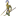
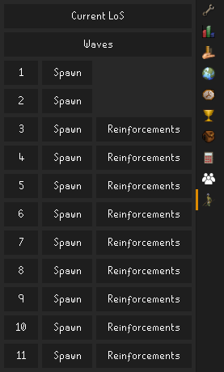
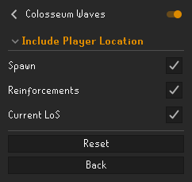

# Colosseum Waves

This plugin captures player & NPC locations for wave spawns & reinforcements in Fortis Colosseum, and
generates [Colosseum LoS](https://los.colosim.com/) links for planning and analysis. You can also generate a "Current
LoS" link to capture the current pillar stack.

## Using the plugin

You access the plugin by clicking on the side panel icon.

Each wave adds a Spawn button and, if reinforcements spawn, a Reinforcements button, each capturing the state of the
wave at that time in the link to the Colosseum LoS tool. The spawn and reinforcements buttons will persist after leaving
the Colosseum, until you start Wave 1 again.

At any point during the wave, you can click on "Current LoS" and it will open a link to the Colosseum LoS tool with
every NPC's current location.

## Config options

Player location is included in links by default, but it can be excluded in config.

